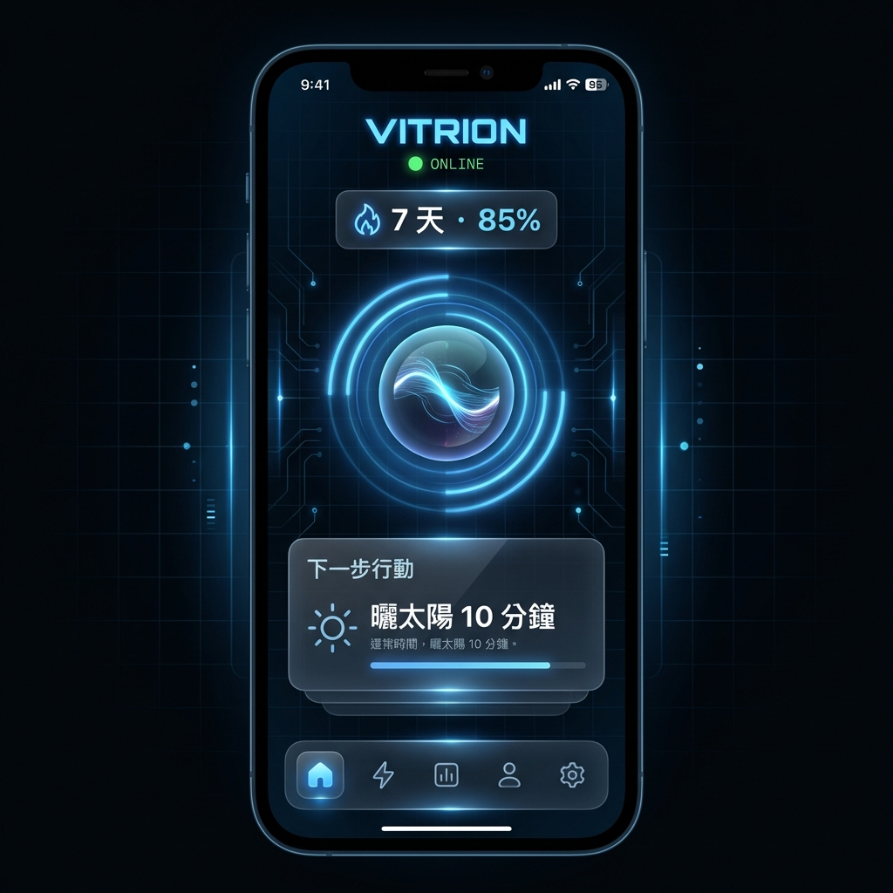
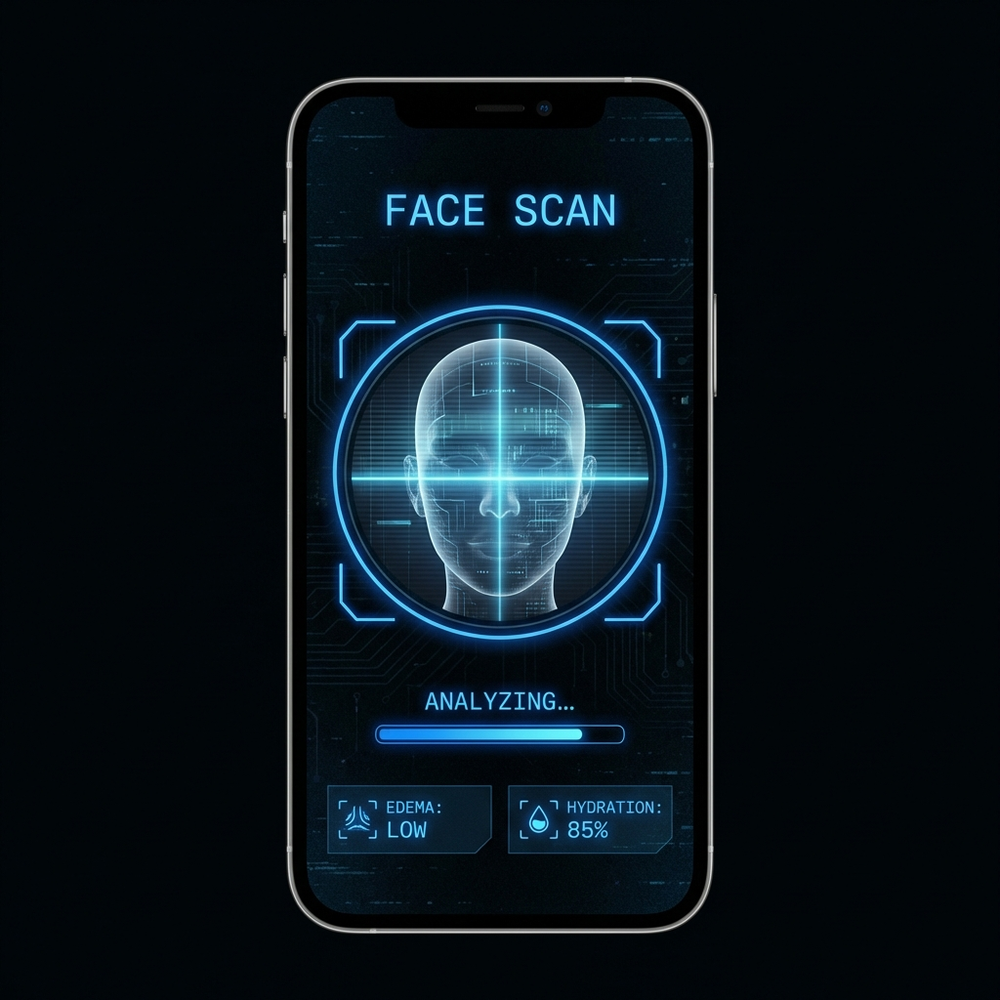
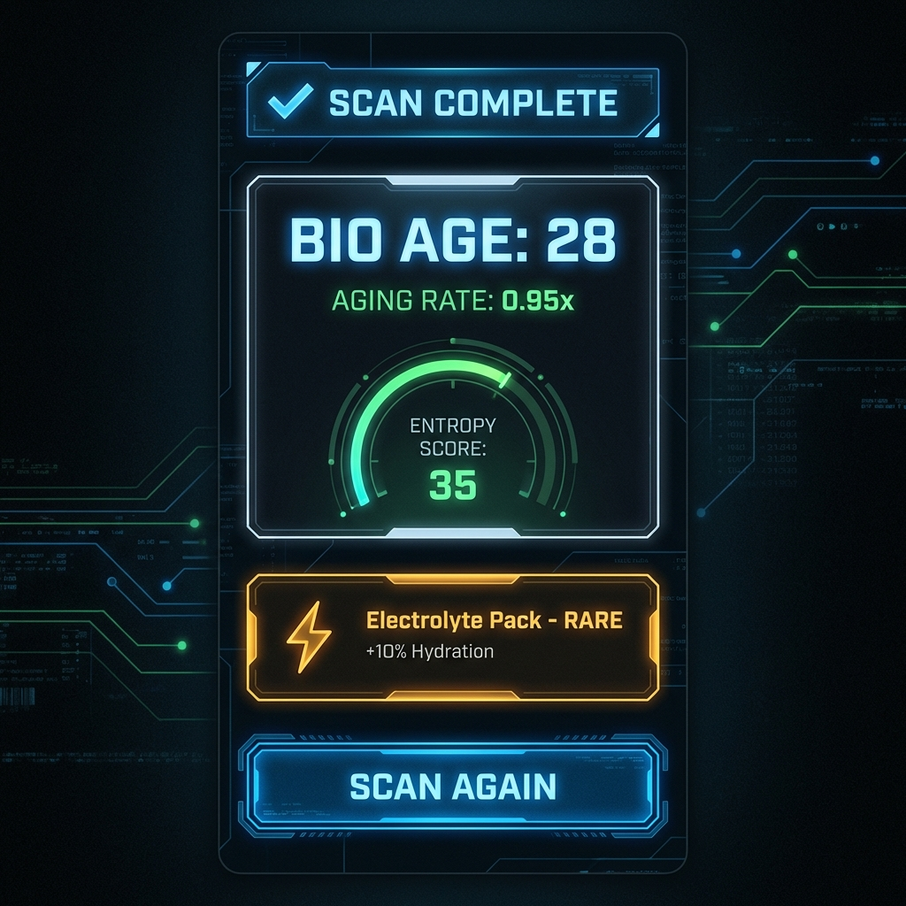

<p align="center">
  
</p>

<h1 align="center">Vitrion</h1>

<p align="center">
  <b>即時生理狀態感測 × AI 行為教練</b><br/>
  用手機相機讀懂你的身體，在你疲勞之前主動介入
</p>

<p align="center">
  
  
  
  
</p>

---

## 📱 Demo

<p align="center">
  
  
  
</p>

<p align="center">
  <sub>Dashboard 首頁 · 臉部掃描 · 分析結果</sub>
</p>

---

## 🎯 問題與機會

在 ChatGPT Health 和 Claude for Healthcare 的時代，**通用健康問答已被商品化**。

但這些 AI 巨頭做不到的是：
- ❌ 無法透過相機**即時感測**你的生理狀態
- ❌ 只能被動回答問題，無法**主動介入**
- ❌ 缺乏行為改變機制，只能**告訴你**而不能**引導你**

**Vitrion 的定位**：不是另一個健康問答 app，而是「即時生理監測 + AI 行為教練」。

---

## ✨ 核心功能

### 1. 📷 臉部生理掃描 (Computer Vision)
利用 MediaPipe Face Landmarker 分析臉部幾何特徵，推估健康狀態：
- **臉部寬高比** - 水腫程度指標
- **下頷線銳利度** - 體脂與水腫相關
- **生物年齡估算** - 基於多維度臉部特徵

```
Input: 手機前鏡頭即時影像
Output: 健康分數 + 個人化建議 + Supply Drop (遊戲化獎勵)
```

### 2. ⏰ 時間感知協議 (Founder Protocol)
根據時間自動推薦「下一步最佳行動」：

| 時段 | 推薦行動範例 |
|------|-------------|
| 早晨 | 曬太陽 10 分鐘、高蛋白早餐 |
| 中午 | 咖啡因窗口提醒、進食順序建議 |
| 下午 | 訓練窗口、補水檢查 |
| 傍晚 | 減少藍光、避免精緻碳水 |
| 夜間 | 補鎂、睡眠環境優化 |

### 3. ☕ 咖啡因智慧計時器
追蹤咖啡因代謝，確保不影響睡眠品質：
- 輸入攝取時間和劑量
- 即時顯示體內咖啡因濃度
- 提醒最後安全攝取時間

### 4. 🎮 遊戲化行為引擎
- **XP 系統** - 完成行動獲得經驗值
- **等級進度** - 視覺化成長軌跡
- **連續天數 (Streak)** - 習慣養成機制
- **30 天挑戰** - 結構化行為改變計畫

---

## 🏗 技術架構

```
┌─────────────────────────────────────────────────────────┐
│                    Mobile App (Expo)                    │
│  React Native + TypeScript + React Native Vision Camera │
└─────────────────────┬───────────────────────────────────┘
                      │ REST API
┌─────────────────────▼───────────────────────────────────┐
│                  Backend (FastAPI)                      │
│  ┌─────────────┐  ┌─────────────┐  ┌─────────────────┐  │
│  │ Face Analyzer│  │ RAG Service │  │  Nutri-Agent   │  │
│  │ (MediaPipe) │  │  (OpenAI)   │  │ (健康建議生成) │  │
│  └─────────────┘  └─────────────┘  └─────────────────┘  │
└─────────────────────────────────────────────────────────┘
```

### 技術棧
| Layer | Technology |
|-------|------------|
| Mobile | Expo SDK 51, React Native, TypeScript |
| Camera | react-native-vision-camera |
| UI | Reanimated, Linear Gradient, Lucide Icons |
| Backend | FastAPI, Python 3.9+ |
| CV | MediaPipe Face Landmarker |
| AI | OpenAI GPT-4 (RAG for insights) |

---

## 🚀 快速開始

### 前置需求
- Node.js 18+
- Python 3.9+
- Expo CLI
- iOS Simulator / Android Emulator

### 安裝步驟

```bash
# 1. Clone repo
git clone https://github.com/YOUR_USERNAME/vitrion.git
cd vitrion

# 2. Backend setup
cd backend
python -m venv venv
source venv/bin/activate  # Windows: venv\Scripts\activate
pip install -r requirements.txt

# 3. Mobile setup
cd ../mobile
npm install

# 4. Run backend
cd ../backend
uvicorn backend.main:app --reload --host 0.0.0.0 --port 8000

# 5. Run mobile (new terminal)
cd mobile
npx expo start
```

---

## 📊 MVP 驗證指標

| 指標 | 目標 | 意義 |
|------|------|------|
| D7 留存率 | > 40% | 用戶是否覺得有價值 |
| 每日掃描次數 | > 1.5 | 習慣是否形成 |
| 協議完成率 | > 60% | 行為引導是否有效 |
| 連續使用天數 | > 7 天 | 黏著度是否足夠 |

---

## 🗺 Roadmap

- [x] MVP: 臉部掃描 + 基礎分析
- [x] Founder Protocol 時間感知推薦
- [x] 咖啡因計時器
- [x] 遊戲化系統 (XP/等級/Streak)
- [ ] 精力預測模型 (累積用戶數據後訓練)
- [ ] Apple Health / Google Fit 整合
- [ ] 聲音疲勞度分析
- [ ] B2B 企業健康方案 API

---

## 📁 專案結構

```
vitrion/
├── mobile/                 # Expo React Native App
│   ├── app/               # 頁面 (Expo Router)
│   │   ├── index.tsx      # Dashboard 主頁
│   │   ├── scan.tsx       # 掃描頁面
│   │   ├── result.tsx     # 結果展示
│   │   └── challenges.tsx # 30 天挑戰
│   ├── src/
│   │   ├── components/    # UI 組件
│   │   │   ├── FounderProtocol.tsx
│   │   │   ├── CaffeineTimer.tsx
│   │   │   └── AvatarDisplay.tsx
│   │   └── context/       # 狀態管理
│   └── assets/            # 圖片資源
│
├── backend/               # FastAPI Backend
│   ├── main.py           # API 入口
│   ├── core/
│   │   ├── face_analyzer.py  # MediaPipe CV 分析
│   │   ├── agent.py          # 健康建議生成
│   │   └── rag_service.py    # RAG 服務
│   └── models/           # ML 模型檔案
│
└── docs/                 # 文件
    └── PRD.md           # 產品需求文件
```

---

## 👤 Author

**[Your Name]**  
Building the future of personal energy management.

---

## 📄 License

MIT License - 詳見 [LICENSE](LICENSE) 檔案
